# $SCHIZO Agent - AI Coding Instructions

## Project Overview
Paranoid AI trading agent for Solana memecoin sniping with real-time personality and entertainment mode. Built as TypeScript ES modules with SQLite persistence, real-time WebSocket streaming, and Claude AI integration.

## Architecture

### Core Pipeline Flowchart

```mermaid
flowchart TB
    Start([TradingLoop Start<br/>Every 10s]) --> CheckQueue{Trending Token<br/>Queue Empty?}
    
    CheckQueue -->|Empty| ScanAPI[Scan Birdeye API<br/>Get Trending Tokens]
    ScanAPI --> QueueTokens[Add to Queue]
    QueueTokens --> CheckQueue
    
    CheckQueue -->|Has Tokens| DequeueToken[Get Next Token<br/>from Queue]
    DequeueToken --> CheckSeen{Already<br/>Analyzed?}
    
    CheckSeen -->|Yes - in seenTokens| Skip[Skip Token]
    CheckSeen -->|No - New Token| Discovery[🔍 DISCOVERY<br/>Emit EVENT]
    
    Discovery --> SafetyCheck[TokenSafetyAnalyzer<br/>Check Honeypot Risks]
    SafetyCheck --> CacheCheck{Cache<br/>Hit?}
    CacheCheck -->|Yes| UseCached[Use Cached Data]
    CacheCheck -->|No| HeliusAPI[Helius DAS API<br/>Get Asset + Holders]
    HeliusAPI --> StoreCache[Store in analysisCache<br/>30min TTL]
    StoreCache --> UseCached
    
    UseCached --> RiskCheck{Token<br/>Safe?}
    RiskCheck -->|Unsafe| Reject[❌ Reject Token<br/>Emit ANALYSIS event]
    RiskCheck -->|Safe| SmartMoney[SmartMoneyTracker<br/>Check Holders]
    
    SmartMoney --> GetWallets[Get Top Holders<br/>from Helius]
    GetWallets --> AnalyzeWallets[WalletAnalyzer<br/>Parse P&L History]
    AnalyzeWallets --> ScoreSmart[Score Smart Money<br/>>5 SOL P&L<br/>>60% Win Rate]
    
    ScoreSmart --> Decision[EntertainmentMode<br/>shouldTrade?]
    Decision --> CalcScore[Calculate Score:<br/>+10 Smart Money<br/>+10 Holder Dist<br/>+5 Momentum]
    CalcScore --> ThresholdCheck{Score >= 25<br/>+ Random<br/>Weighted?}
    
    ThresholdCheck -->|No| Skip2[Skip Trade<br/>Emit DECISION event]
    ThresholdCheck -->|Yes| Execute[🚀 TradingEngine<br/>Execute Buy]
    
    Execute --> CheckGrad{Token<br/>Graduated?}
    CheckGrad -->|No| PumpFun[PumpPortal Client<br/>Buy on pump.fun]
    CheckGrad -->|Yes| Jupiter[Jupiter Client<br/>Swap on DEX]
    
    PumpFun --> StoreTrade[Store in db.trades]
    Jupiter --> StoreTrade
    StoreTrade --> Commentary[CommentarySystem<br/>Queue TRADE_RESULT]
    
    Commentary --> Priority[Priority Queue<br/>15s Min Gap]
    Priority --> ClaudeGen{Claude<br/>Available?}
    ClaudeGen -->|Yes| Generate[Generate AI Speech]
    ClaudeGen -->|No| Skip3[Skip Commentary]
    Generate --> Broadcast[Emit COMMENTARY_READY]
    
    Broadcast --> WSBroadcast[WebSocket Server<br/>Broadcast to Dashboard]
    Skip --> WSBroadcast
    Skip2 --> WSBroadcast
    Skip3 --> WSBroadcast
    Reject --> WSBroadcast
    
    WSBroadcast --> TimePressure{60s Since<br/>Last Action?}
    TimePressure -->|Yes| RestlessEvent[Emit TIME_PRESSURE<br/>Commentary]
    TimePressure -->|No| End
    RestlessEvent --> End([End Cycle<br/>Wait 10s])
    
    style Discovery fill:#4CAF50,color:white
    style Execute fill:#2196F3,color:white
    style Reject fill:#f44336,color:white
    style Broadcast fill:#FF9800,color:white
    style WSBroadcast fill:#9C27B0,color:white
```



### Core Pipeline (4 Phases)
1. **Detection** → PumpPortal WebSocket or Birdeye trending API discovers new tokens
2. **Analysis** → `TokenSafetyAnalyzer` checks on-chain risks, `SmartMoneyTracker` evaluates wallet performance
3. **Decision** → `EntertainmentMode` makes trade decisions (ENTERTAINMENT risk profile for frequent degen trades)
4. **Execution** → `TradingEngine` executes via PumpPortal (pump.fun) or Jupiter (graduated tokens)

### Event-Driven System
All components communicate via `agentEvents` singleton ([src/events/emitter.ts](src/events/emitter.ts)):
- Emit events: `agentEvents.emit({ type: 'TOKEN_ANALYZED', data: {...} })`
- Listen: `agentEvents.on('TRADE_EXECUTED', handler)`
- WebSocket server auto-broadcasts events to dashboard ([src/server/websocket.ts](src/server/websocket.ts))

### Data Flow
```
PumpPortal/Birdeye → TradingLoop.scanForOpportunities() → TokenSafetyAnalyzer
→ SmartMoneyTracker → EntertainmentMode.shouldTrade() → TradingEngine.executeBuy()
→ Database.trades → CommentarySystem (queued) → agentEvents → WebSocket → Dashboard
```

### Database Pattern
SQLite with repository pattern ([src/db/database-with-repos.ts](src/db/database-with-repos.ts)):
```typescript
const db = createDatabaseWithRepositories(rawDb);
db.trades.insert({ signature, tokenMint, type: 'BUY', ... });
db.analysisCache.get('tokenMint', 'holderDistribution');
db.state.set('lastTrendingScan', Date.now());
```

## Key Components

### TradingLoop ([src/trading/trading-loop.ts](src/trading/trading-loop.ts))
Main orchestrator - runs every 10s, processes trending tokens from Birdeye API queue:
- `scanForOpportunities()` - Checks Birdeye trending API (respects rate limits)
- `processNextTrendingToken()` - Analyzes one token from queue per cycle
- `handleTimePressure()` - Emits restless commentary if no action for 60s
- **Deduplication**: `seenTokens` Map tracks analyzed tokens with 5min expiry

### TokenSafetyAnalyzer ([src/analysis/token-safety.ts](src/analysis/token-safety.ts))
Checks on-chain honeypot risks via Helius DAS API:
- Mint authority, freeze authority, Token-2022 extensions
- Holder distribution via `checkHolderDistribution()` (top holder %, insider concentration)
- **Caching**: Uses `db.analysisCache` with 30min expiry to reduce API calls

### SmartMoneyTracker ([src/analysis/smart-money.ts](src/analysis/smart-money.ts))
Identifies profitable wallets (>5 SOL total P&L, >60% win rate):
- Parses Helius transaction history via `WalletAnalyzer.analyzeWallet()`
- Stores in `smart_wallets` table with performance metrics
- Used by `EntertainmentMode` to boost scoring (+10 points per smart wallet)

### EntertainmentMode ([src/trading/entertainment-mode.ts](src/trading/entertainment-mode.ts))
Frequent degen trading decisions (0.01-0.02 SOL per trade):
- Scoring: Smart money +10, good holder dist +10, momentum +5, min 25 points to trade
- Weighted randomness with bias toward high scores (60-70%+ pass threshold)
- **Risk profile**: ENTERTAINMENT (lowest position sizes, highest frequency)

### CommentarySystem ([src/personality/commentary-system.ts](src/personality/commentary-system.ts))
Priority queue for AI speech timing (15-20s min gap between commentary):
- Beats: `TRADE_RESULT` (priority 100) > `DECISION` (80) > `ANALYSIS` (60) > `DISCOVERY` (40)
- Context-aware prompts via `prompts.ts` (paranoid style, time pressure, shill analysis)
- Expires stale commentary after 30s to stay relevant

## Critical Workflows

### Build & Run
```bash
npm run dev        # Direct TS execution via tsx (development)
npm run build      # Compile to dist/ (production)
npm start          # Run compiled JS from dist/
```

### Environment Setup
Required in `.env`:
```bash
HELIUS_API_KEY=        # On-chain data (free tier: 10 req/s)
ANTHROPIC_API_KEY=     # Claude personality (optional)
BIRDEYE_API_KEY=       # Trending tokens (free tier)
WALLET_KEYSTORE=       # Path to encrypted keystore file
WALLET_PASSWORD=       # Keystore decryption password
```

### Keystore Management
Encrypted wallet storage ([src/keystore/](src/keystore/)):
```typescript
import { createKeystore, saveKeystore, loadKeystore } from './keystore/index.js';

// Create new wallet
const { keypair, keystore } = createKeystore('password');
saveKeystore(keystore, 'wallet.keystore.json');

// Load existing wallet
const keypair = loadKeystore('wallet.keystore.json', 'password');
```

### Testing Trades
Use `src/test-devnet.ts` for devnet testing (imported trades for P&L display):
```typescript
// Historical trades are pre-populated in index.ts for dashboard demo
const historicalBuy = { signature: '...', type: 'BUY', ... };
db.trades.insert(historicalBuy);
```

## Conventions & Patterns

### ES Modules
All imports require `.js` extension (resolved to `.ts` by tsx):
```typescript
import { logger } from './lib/logger.js';  // NOT './lib/logger'
```

### Logging
Structured JSON logging via Pino ([src/lib/logger.ts](src/lib/logger.ts)):
```typescript
import { createLogger } from './lib/logger.js';
const log = createLogger('module-name');
log.info({ tokenMint, score }, 'Token scored');
log.error({ error }, 'Failed to fetch data');
```

### Error Handling
Circuit breakers via Opossum for external APIs ([src/api/helius.ts](src/api/helius.ts)):
- Auto-retry with exponential backoff (p-retry)
- Rate limiting via Bottleneck (respects API tier limits)
- Graceful degradation: missing Claude/Jupiter disables features but doesn't crash

### Type Safety
Strict TypeScript with shared types:
- Trading types: [src/trading/types.ts](src/trading/types.ts) (`TradeParams`, `RiskProfile`)
- Analysis types: [src/analysis/types.ts](src/analysis/types.ts) (`TokenRisk`, `GetAssetResponse`)
- Event types: [src/events/types.ts](src/events/types.ts) (`AgentEvent`)

### API Integration
Dual token lifecycle support:
- **pump.fun tokens**: PumpPortal WebSocket + REST ([src/trading/pumpportal-client.ts](src/trading/pumpportal-client.ts))
- **Graduated tokens**: Jupiter swap API ([src/api/jupiter.ts](src/api/jupiter.ts))
- Market data: Birdeye (trending), DexScreener (pairs), GeckoTerminal (backup)

## Orphaned Code
These files exist but are **NOT integrated** into the pipeline ([docs/analysis-architecture.md](docs/analysis-architecture.md)):
- [src/analysis/bundle-detector.ts](src/analysis/bundle-detector.ts) - Would detect coordinated buys (352 lines)
- [src/analysis/momentum-scanner.ts](src/analysis/momentum-scanner.ts) - Would check buy pressure (444 lines)
- [src/analysis/learning-engine.ts](src/analysis/learning-engine.ts) - Would adjust scoring weights (439 lines)

**Do not reference these in new features** unless explicitly integrating them into `TradingLoop` or `EntertainmentMode`.

## Frontend Dashboard
Vanilla JS WebSocket client ([public/app.js](public/app.js)):
- Connects to `ws://localhost:8080`
- Auto-reconnect with exponential backoff
- Real-time trade updates, P&L calculation, position display
- 3D particle system ([public/schizo-3d.js](public/schizo-3d.js)) for visual interest

## Common Pitfalls
1. **Rate limits**: Helius free tier = 10 req/s. Use `db.analysisCache` for holder distribution (30min TTL)
2. **Token lifecycle**: Check if graduated before using PumpPortal (will fail on Raydium tokens)
3. **Event timing**: Commentary has 15s min gap - don't emit `COMMENTARY_READY` for every analysis
4. **Memory leaks**: Clear `seenTokens` Map periodically (5min expiry in TradingLoop)
5. **Database locking**: SQLite is single-writer - avoid concurrent writes from multiple instances

## External APIs
Reference [CLAUDE.md](CLAUDE.md) for full API docs (auto-loaded in Claude Code sessions):
- Helius SDK methods, rate limits, transaction parsing
- Jupiter quote/swap flow, token info endpoint
- Birdeye trending API, DexScreener pair data
- PumpPortal WebSocket protocol, buy/sell endpoints
