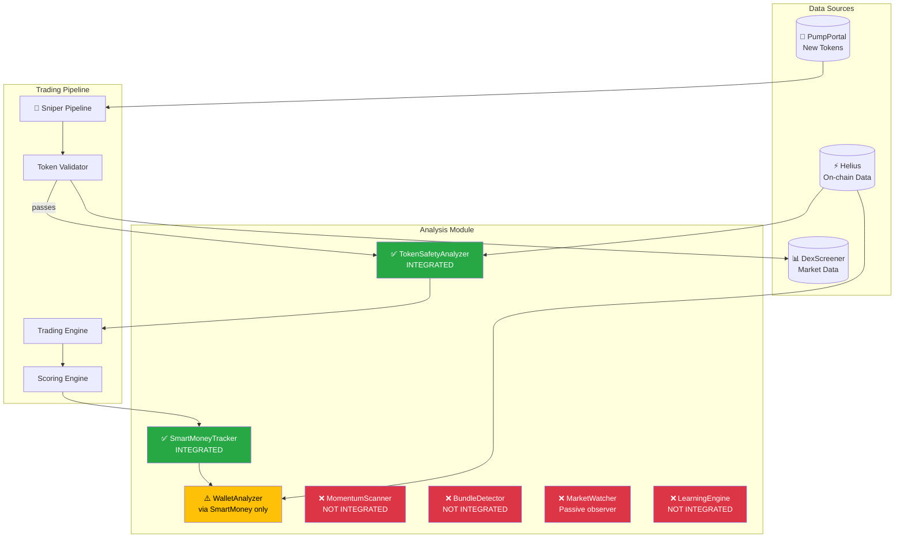
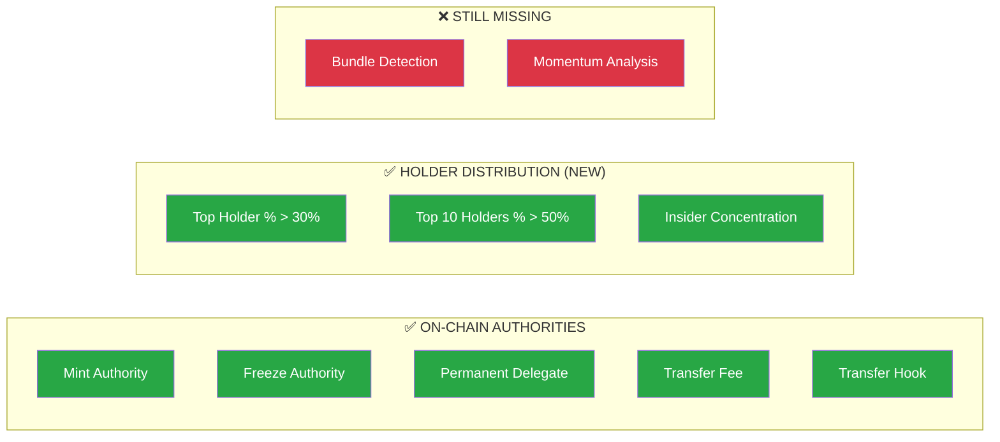
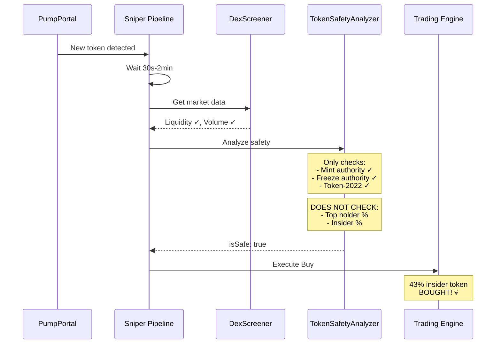
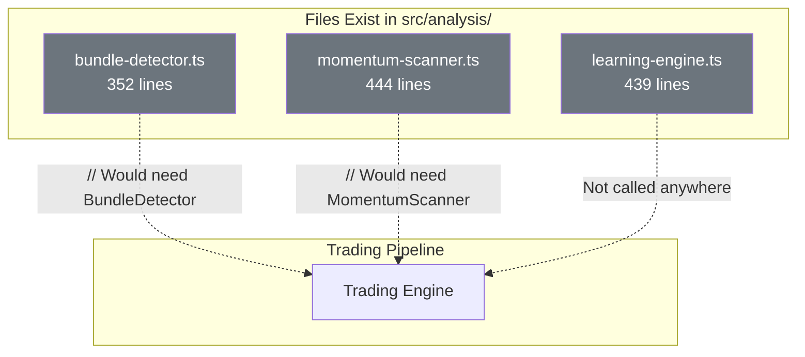

# Analysis Architecture Diagram

## Current Integration Status

---

## What TokenSafetyAnalyzer Checks ✅ (Updated)

---

## Why 43% Insider Token Got Through

---

## Orphaned Code (Exists but Not Connected)

---

## Summary Table

| Analyzer | Lines | Purpose | Status |
|----------|-------|---------|--------|
| TokenSafetyAnalyzer | 157 | On-chain authority checks | ✅ Integrated |
| SmartMoneyTracker | 203 | Identify profitable wallets | ✅ Integrated |
| WalletAnalyzer | 310 | Parse wallet P&L | ⚠️ Indirect |
| MomentumScanner | 444 | Heat/buy pressure | ❌ Orphaned |
| BundleDetector | 352 | Detect coordinated buys | ❌ Orphaned |
| MarketWatcher | 532 | Passive learning | ❌ Passive |
| LearningEngine | 439 | Adjust weights | ❌ Orphaned |
